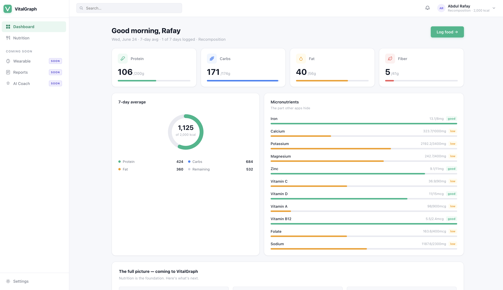

# VitalGraph

**A personal AI health companion — grounded in your own data, and honest about what it doesn't know.**

🔗 **Live demo:** https://vitalgraph.vercel.app — nutrition tracking is live; AI coach, wearables, and lab reports are on the roadmap.

---

## What it is

VitalGraph is a full-stack personal nutrition and health app built with Vite + React on the frontend and a FastAPI + Anthropic backend. It tracks what you eat in clinical detail — not just calories, but the full amino-acid and fatty-acid breakdown of every meal — and uses that data to explain your personalised targets without inventing numbers.



The long-term aim is to fuse three data streams — nutrition, wearable recovery, and health reports — into one AI that reasons across all of them over time. The nutrition foundation is the first and most data-intensive of the three, and it's what's built and working today.

---

## Features

### Science-based personalised targets
Targets are computed from your profile using the Mifflin-St Jeor equation for BMR, scaled by activity level and adjusted for your goal (fat loss, recomp, muscle gain). Safety floors prevent dangerously low intakes. A live macro editor lets you override any value, with automatic rebalancing to keep the calorie total consistent.

### Food logging with variants
Type a food and amount — `200g chicken breast`, `2 eggs`, `1 scoop whey` — and the app parses the quantity and unit. Foods with distinct nutritional profiles (whole egg vs. egg whites vs. omelette cooked in ghee) are modelled as separate variants, each with their own amino-acid and fatty-acid data. A configure panel lets you pick the variant and adjust the amount with a live macro preview before logging.

### Live USDA FoodData Central search
When a food isn't in the local database, it's looked up against USDA FoodData Central on demand. Results are cached locally; logged amounts carry through correctly even when the original quantity was specified in the query (e.g. `200g mango`).

### Macro drill-downs with full sub-profiles
Click any macro card to expand an inline breakdown:

- **Protein →** full amino-acid profile across all 18 amino acids. The 9 essentials are shown by default; leucine is highlighted as the primary driver of muscle protein synthesis.
- **Fat →** saturated / monounsaturated / polyunsaturated / omega-3 / omega-6.
- **Carbs →** sugars / starch / added sugar.
- **Fiber →** soluble / insoluble.

Each panel also lists the foods from today's log that contributed to that macro, sorted by contribution.


### Honest "not reported" handling
Where the data source doesn't report a value (ghee has no amino data; many USDA entries omit omega sub-fractions), the app shows **"not reported"** and tracks partial coverage (`2/3 foods reported`). Nothing is fabricated or zeroed out silently.

### Per-day persistence
The daily log is stored in `localStorage` keyed by date. On reload, food objects are re-linked from the local database or USDA cache; only the minimal data (`foodId`, `grams`, `variantId`) is persisted.

### Grounded AI plan-explainer
The Plan page connects to the FastAPI backend to request a plain-language explanation of your computed targets. The model receives your profile, BMR, TDEE, and macro targets — it explains the numbers, not hallucinations. The endpoint is rate-limited, requires no user authentication, and handles key management server-side. The explainer requires the local FastAPI backend; on the live demo it appears as "coming soon" until the backend is hosted.

---

## Tech stack

| Layer | Tools |
|---|---|
| Frontend | Vite, React 18, React Router v7, Lucide icons |
| Backend | FastAPI, Anthropic API (Claude), Uvicorn |
| Data | USDA FoodData Central API |
| Persistence | `localStorage` (log + USDA cache + profile) |

---

## Architecture

```
nutrition-app/
├── web/        # Vite + React app (the current product)
└── backend/    # FastAPI server — AI plan-explainer endpoint
```

`web/` and `backend/` each have a `.env.example` documenting the required keys. Neither `.env.local` nor `backend/.env` are ever committed.

---

## Running locally

**Frontend**
```bash
cd web
npm install
cp .env.example .env.local   # add your USDA FoodData Central key
npm run dev
```

**Backend** (required only for the AI plan-explainer)
```bash
cd backend
python -m venv venv && source venv/bin/activate
pip install -r requirements.txt
cp .env.example .env         # add your Anthropic API key
uvicorn main:app --reload
```

The `.env.example` files in each directory document exactly which keys are needed and where to get them.

---

## Roadmap

| Feature | Status |
|---|---|
| Wearable sync — recovery, HRV, sleep quality, resting heart rate | Planned |
| Health reports — upload lab panels; VitalGraph reads and contextualises them | Planned |
| AI coach — cross-source reasoning across nutrition, recovery, and health data over time | In progress |

---

## Design principles

- **Grounded, not generated** — every value traces to a source (USDA, Mifflin-St Jeor, your profile). Nothing is invented.
- **Honest about uncertainty** — "not reported" is a first-class state, not a gap to paper over.
- **Defers, doesn't diagnose** — the AI explains and surfaces considerations; it does not diagnose. Consult qualified professionals on anything medical.
- **Built for sustainable patterns** — not gamified streaks or restriction.

---

*Built by an MS AI graduate with a focus on Medical-AI, ML, and Computer Vision — open to opportunities.*

*VitalGraph is a personal project. It is a tracking and reasoning tool, not medical advice, and is not a substitute for professional healthcare.*
