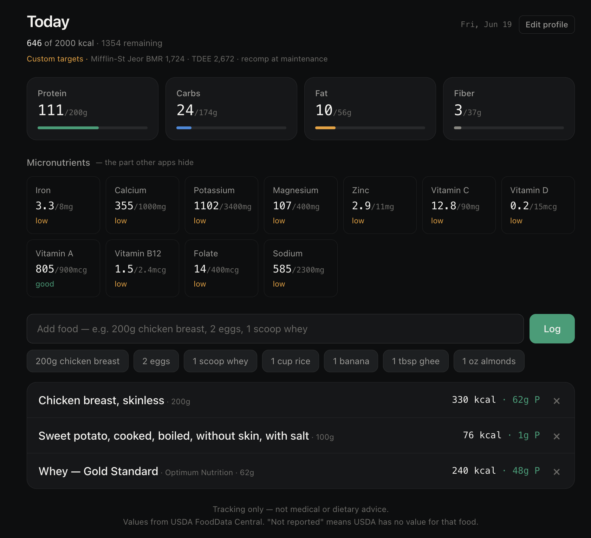
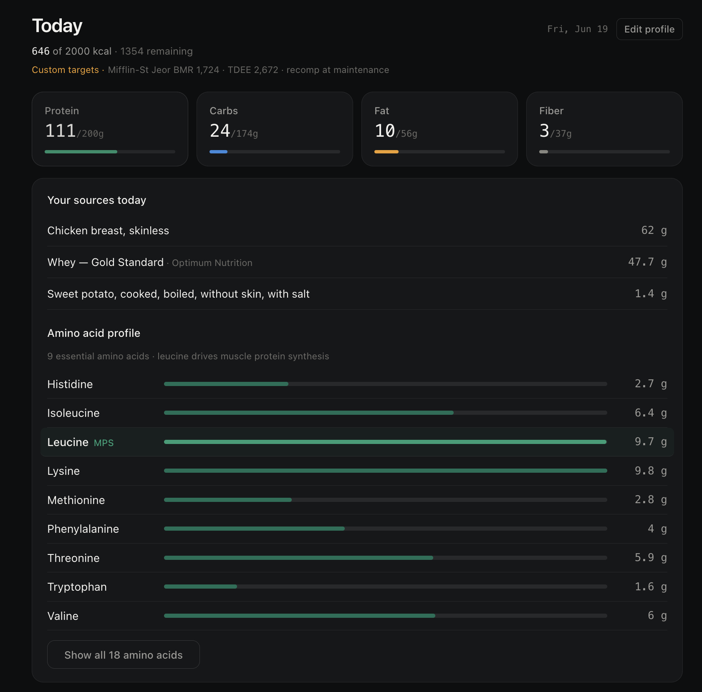

# VitalGraph

**A personal AI health companion — grounded in your own data, and honest about what it doesn't know.**

VitalGraph aims to be the always-available, data-grounded equivalent of the team a serious athlete or health-focused person would otherwise need: a nutritionist who knows exactly what you ate and what your body needs, a coach who sees your recovery and training load, and a health-data assistant that reads your reports in context — reasoning across all of it, over time, to surface honest, uncertainty-aware guidance.

It is built on one principle: **every suggestion traces to real data, and the system says "I don't know" rather than inventing an answer.**

---

## The vision

Most health tools show you *data* — here's your HRV, here are your macros — and leave the thinking to you. They live in silos: your nutrition app doesn't know your sleep, your wearable doesn't know your bloodwork, and none of them reason across the three.

VitalGraph fuses three streams into one evolving picture of your health:

- **Nutrition** — everything you eat, tracked precisely: calories, macros, micronutrients, and full amino-acid / fatty-acid profiles — including branded products and home-cooked composite dishes built from their ingredients.
- **Body & wearable data** — recovery, sleep, HRV, resting heart rate, and activity (e.g. Apple Watch / WHOOP-style metrics).
- **Health reports** — lab panels and bloodwork, read and understood in context.

The point is not three dashboards — it's one AI that reasons *across* sources, *over time*. The signature capability is the longitudinal, cross-source insight:

> *"Your recovery has trended down three days while protein's been under target and sleep's been short — here's how these likely connect, and what to consider adjusting."*

That kind of grounded, multi-source, reasoned suggestion is the thing existing tools don't do — and it's the entire point of VitalGraph.

**On the clinical side, by design:** VitalGraph is a reasoning and pattern-surfacing tool, not a diagnostic one. It explains what your data shows, flags what's worth attention, and **defers to qualified professionals on anything medical.** It surfaces considerations; it does not diagnose. It is built to support sustainable, healthy patterns — never to push toward restriction or to replace clinical judgment.

## Where it is today

The **nutrition foundation is built and working** — the first and most data-intensive of the three streams. Current capabilities:

- **Natural food logging** — type a food and amount ("200g chicken breast", "2 eggs"); the app parses quantity, unit, and food.
- **Macro + micronutrient tracking** — calories, protein, carbs, fat, and fiber against daily targets, plus 11 micronutrients with at-a-glance low/good status (the micronutrients most apps don't surface).
- **Drill-down profiles** — click any macro to see the contributing foods *and* its scientific breakdown:
  - **Protein →** full amino-acid profile; the 9 essential amino acids by default (leucine highlighted as the driver of muscle protein synthesis), expandable to all 18.
  - **Fat →** saturated / monounsaturated / polyunsaturated / omega-3 / omega-6.
  - **Carbs →** sugars / starch / added sugar. **Fiber →** soluble / insoluble.
- **Food variants** — the same food in different forms carries different nutrition (whole egg vs. egg whites vs. omelette cooked in ghee), each modeled separately.
- **Live USDA search** — foods not held locally are looked up on demand against USDA FoodData Central and logged like any other food.
- **Honest data** — where the source doesn't report a value, the app shows **"not reported"** rather than fabricating one.
- **Per-day persistence** — the daily log is saved by date and survives reloads (the data model the longitudinal features will build on).

## Screenshots

**Dashboard — personalized science-based targets, macros, and the micronutrients most apps don't show:**



**Macro drill-down — every macro opens into its profile; protein shows the full amino-acid breakdown with leucine (the driver of muscle protein synthesis) highlighted:**



## Tech

- **React 18** (single-file, in-browser Babel — runs with no build step)
- **USDA FoodData Central API** for the food database
- **localStorage** for per-day persistence, with a separate cache for USDA-sourced foods
- Dark-mode, precision-dashboard design in vanilla CSS

## Running it locally

1. Get a free USDA FoodData Central API key: https://fdc.nal.usda.gov/api-key-signup
2. Create a `config.js` file in the project root:
   ```js
   window.USDA_API_KEY = "your_key_here";
   ```
   *(This file is gitignored and never committed — the key stays on your machine.)*
3. Open `nutrition-dashboard.html` in a browser. Local foods work with no key; USDA search requires it.

## Design principles

- **Grounded, not generated** — every value traces to a source; nothing is invented.
- **Honest about uncertainty** — "not reported" is a feature, not a gap.
- **Defers, doesn't diagnose** — surfaces considerations and points to professionals on anything clinical.
- **Built for healthy, sustainable patterns** — not gamified streaks or restriction.

## Roadmap

The path from today's nutrition foundation to the full vision:

1. **Personal food database** — save USDA foods locally for instant, accurate logging; build up a curated set of your real foods.
2. **Recipe builder** — compose multi-ingredient dishes from USDA ingredients and log them as one item.
3. **Longitudinal view** — day-over-day trends across nutrition (the per-day data model is already in place).
4. **Wearable integration** — bring in body data (Apple Watch / WHOOP-style metrics).
5. **Health-report ingestion** — read and contextualize lab panels.
6. **Cross-source reasoning** — the AI layer that fuses all three streams into grounded, longitudinal, uncertainty-aware guidance.

---

*VitalGraph is a personal project and a tracking and reasoning tool. It is not medical advice and is not a substitute for professional healthcare.*
